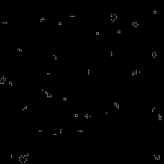
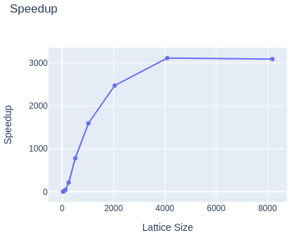
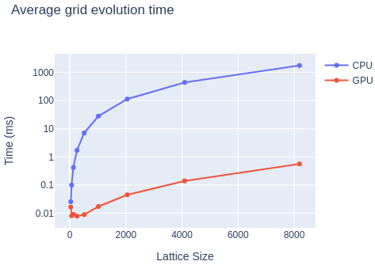

# Cellular Automata

A [Cellular Automata](https://en.wikipedia.org/wiki/Cellular_automaton) program built with C++, OpenGL, CUDA and OpenMP. It's built to run on a GPU but it also supports multithreaded CPU-only execution. On the right there's an example execution of [Conway's Game of Life](https://en.wikipedia.org/wiki/Conway%27s_Game_of_Life) on a 100x100 randomly initialised lattice.

The main objective of this project is to allow scaling up to a reasonably large number of cells while maintaining the code legibility and allowing for further customisations. It supports command-line arguments to set up quick configs (run `./automata -h` for details) like headless mode (which is significantly faster) and initial patterns (which can be loaded from the `patterns` folder). It doesn't yet support the definition of evolution rules at runtime or lattice size inference, but I'm working on that.

This program can currently evolve a dense & high entropy 182.25 million cell Game of Life grid (13500x13500) with rendering enabled with up to 320 generations per second on a Ryzen 7 3700X / RTX 3080 using up to 200MB RAM and 8.5GB VRAM (which is the actual scaling limiter).

The ability to evolve and render such large grids allows the program to run some really interesting patterns, like evolving the Game of Life _within_ the Game of Life:

In the GIF above we're running a 12300x12300 grid using Game of Life rules to evolve a pattern known as [Meta-Toad](http://b3s23life.blogspot.com/2006_09_01_archive.html). It uses a grid of [OTCA Metapixels](https://www.conwaylife.com/wiki/OTCA_metapixel) and requires about 35 thousand generations of the underlying automaton to represent a single generation of the meta-grid. The pattern being evolved by the meta-grid is known as [Toad](https://www.conwaylife.com/wiki/Toad):

 
This program also supports a benchmark mode (`-b` option), which outputs the total and average evolution and rendering timings to stdout. Combined with `benchmark.sh` and `benchmark_visualize.ipynb`, it is possible to plot speedups and evolution times for different lattice sizes. Currently, the GPU implementation achieves a relative speedup of more than 3000x over the single-core CPU implementation.

 

 

> Speedup over serial (left) and average grid evolution time in milliseconds (right) for lattice sizes 32x32, 64x64, ..., 8192x8192 and 1000 generations, using logarithmic Y axis. "# Threads" refers to the number of threads available for OpenMP CPU (Ryzen 7 3700X) runs while "GPU" refers to CUDA (RTX 3080) runs. For these tests, initial spawn probability was set to 0.5 and rendering was disabled.

## Requirements

To run the program you'll need:

- Debian-like linux distro (I only tested this on Ubuntu 20)
- OpenGL\* (GLEW, GLUT and GLM)
  - e.g. `sudo apt-get install libglew-dev freeglut3-dev libglm-dev`
- [CUDA](https://developer.nvidia.com/cuda-downloads)\*\* (nvcc) and CUDA runtime libraries

To build it from source you'll also need:

- g++ (C++ 17) and _make_
  - e.g. `sudo apt install build-essential`
- Boost C++ Library (program_options module)
- [spdlog](https://github.com/gabime/spdlog)

\*It is possible to run this program in headless-only mode, so if your machine doesn't support rendering (e.g. Colab runtimes) you may skip the OpenGL installation step. For that to work you must compile the program with the `HEADLESS_ONLY` flag set (e.g. `make automata HEADLESS_ONLY=1`).

\*\*It is also possible to run this program in CPU-only mode, so if you don't have a CUDA-capable video card you may skip the CUDA installation step. For that to work you will need to compile the program with the `CPU_ONLY` flag set (e.g. `make automata CPU_ONLY=1`).

## Usage

### Building From Source

- Install the requirements
- Clone this repository
- Building and executing (refer to Requirements for useful flags):
  - Run `make` to build and run
  - Run `make build` to build
  - Run `make run` to run with default parameters
  - Run `make clean` to remove generated files
  - Run `make profile` to run [NVIDIA's nsys](https://developer.nvidia.com/nsight-systems) profiling.

### Executing a pre-built binary (Linux x64 + CUDA only)

- Download `cellular-automata-linux64.zip` from the [latest release](https://github.com/bryanoliveira/cellular-automata/releases)
- Extract the executable (`automata`) and the `patterns` folder
- Install OpenGL and CUDA from the requirements above
- Run `./automata -h` to see all the available options
- Run the program with `./automata --render`.

You may want to set the number of available threads when running in CPU. For that, set the environment variable `OMP_NUM_THREADS` (e.g. `env OMP_NUM_THREADS=8 ./automata -r`).

If your GPU has enough VRAM (>= 8 GB), you may be able to reproduce the Meta-Toad simulation above. Run `./automata -r -x 12300 -y 12300 -p 0 -f patterns/meta-toad.rle` to try it out!

### Runtime Controls

- Basic controls:
  - **space** pauses/resumes the simulation;
  - **enter/return** runs a single generation;
  - **left mouse click** translates the grid relative to the max resolution
  - **ctrl + left mouse click** translates the camera relative to the world
  - **mouse scroll** zooms the grid in and out, relative to the max resolution
  - **ctrl + mouse scroll** zooms the camera, relative to the world
  - **middle mouse click** resets scale and translation

## Next steps

There is still much room for improvement. This includes better memory management, use of CPU parallelism and automated tests. My next steps include (but are not limited to):

- Addition of unit tests (in progress)
- Usage of templates to abstract grid data types (e.g. cells should be represented with 1 bit instead of 8)
- Usage of SM shared memory to explore data locality
- Support for flexible rule definition
- Support for infinite grids (e.g. storing only active cells)
- Support for 3-D and N-D grids

## References

- What are [Cellular Automata](https://en.wikipedia.org/wiki/Cellular_automaton)?
- What is [Conway's Game of Life](https://en.wikipedia.org/wiki/Conway%27s_Game_of_Life)?
- [Golly](http://golly.sourceforge.net/): an open source cellular automata simulator that supports several Game of Life and other automata algorithms;
- [Life](https://copy.sh/life/): an open source JavaScript implementation of Game of Life that runs in the browser;
- [Conway's Life: Work in Progress](http://b3s23life.blogspot.com/2006_09_01_archive.html): where I got the initial pattern for the Meta-Toad;
- [The Recursive Universe](https://blog.amandaghassaei.com/2020/05/01/the-recursive-universe/): explores and explains how some of the meta-patterns work;
- What are [OTCA Metapixels](https://www.conwaylife.com/wiki/OTCA_metapixel)?

## Bonus

> A 1000x1000 randomly initialized grid running Game of life.

---

This program was developed during the 2021/1 Parallel Computing (CCO0455) Computer Science graduate course at Universidade Federal de Goiás (UFG, Brazil).
